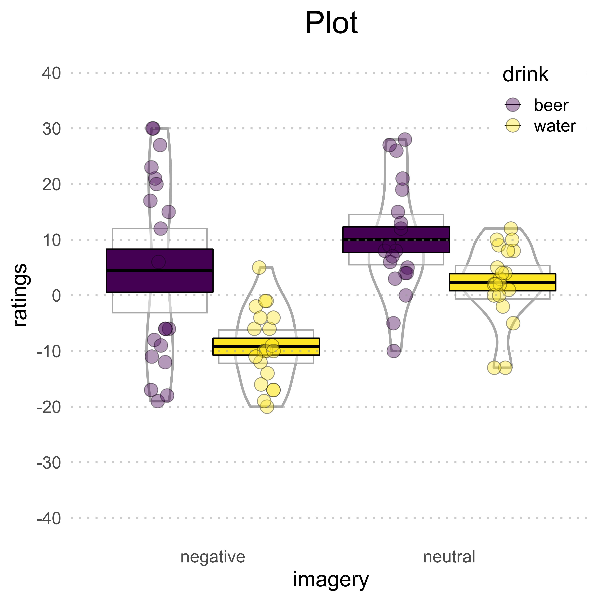

```{r setup, include = FALSE}

library(here)
library(tidyverse)
library(emo)
library(viridis)
library(ggpirate)
library(afex)
library(multcomp)
library(emmeans)
library(bootES)

```

Today we will go through a series of steps that are familiar to many scientist doing empirical work. We will pretend to have collected some data[^1], **clean** them, **visualize** them, and **analyze** them using common statistical models. We will do all these things with the [```tidyverse```](https://www.tidyverse.org/), a collection of **R** packages for data manipulation and plotting that aims at being easily readable not only for machines, but also for humans[^2]. These operations will be run in an environment that ensures computational reproducibility: if you have the initial data set, you will be able to reproduce the final results with a mouse click.

On your computer, you should already have installed **R** and **RStudio** (if not, follow the instructions for your operating system [here](https://cloud.r-project.org/) and [here](https://rstudio.com/products/rstudio/download/#download)).

# Setup

One possible way to work on a project is to open a new _.R_ file and write your code there. However, there are a few disadvantages:

* your collaborators may not have your same folder structure, i.e., where you store data and code
    + you **could** specify a working directory with ```setwd()```, e.g., ```setwd("NAME/OF/YOUR/DIRECTORY")```
* you cannot know the state of your collaborators' working environment, e.g., what functions or packages they have already loaded
    + you **could** include, at the beginning of your script, the following lines:
        - ```cat("\014")``` to clear the console
        - ```rm(list = ls())``` to clear the environment (but it does **not** unload active packages!)

You **could** do all those things, but... **should** you?

<blockquote class="twitter-tweet" data-lang="en"><p lang="en" dir="ltr"><a href="https://twitter.com/hadleywickham/status/940021008764846080"></a></blockquote>
<script async src="//platform.twitter.com/widgets.js" charset="utf-8"></script>

[Jenny Bryan](https://jennybryan.org/) explains the reasons (without threats to commit arson) in [this blog post](https://www.tidyverse.org/blog/2017/12/workflow-vs-script/). The main idea is to package code in a self-contained environment that everyone (including your future self) can run without changing their own environment.

## R Projects

Following Jenny Brian's suggestion (and to avoid her wrath) we can create a project directly from RStudio:

* click the “File” menu button, then “New Project”
* click “New Directory”
* click “New Project”
* type in the name of the directory to store your project, e.g., “YOURNAME_MPI2020_intro_tidyverse”
* click the “Create Project” button

If you check the directory you just created, you will see a file called ```YOURNAME_MPI2020_intro_tidyverse.Rproj```. If your RStudio session is still open, look at the top of the active window: the R Project is already active.


## Install Packages

It is time to install the first package of this session: ```here```[^3]. For a brief overview of what the package can do, see [this GitHub repository](https://github.com/jennybc/here_here) (authored by Jenny Bryan!).

```{r install_here, eval = FALSE}

install.packages("here")

```

Once the package is installed, we can load it:

```{r load_here}

library(here)

```

This package is very useful to keep raw data, analysis scripts, preprocessed data, and reports in separate subdirectories (which is what you should always aim for). In which directory are we now?

```{r here_basedir}

here()

```

We are now in the directory of the _.Rproj_ file. However, our data are in a subdirectory called ```raw-data```. ```here``` allows you to link to that directory without actually going there.

```{r here_datadir}

here("raw-data")

```

In other words, we are still inside our _R Project_ directory (_`r here()`_) but we can load and save files inside the respective subfolders.

Let's verify that the data we need are actually in the ```raw-data``` subdirectory:

```{r filelist}

list.files(here("raw-data"))

```

Yes, the file **`r list.files(here("raw-data"))`** is what we are going to play with today.

## Exercise 1

Install and load the ```tidyverse```.

```{r exercise_1}

# INSERT CODE HERE

```

# Data manipulation

The data are in *.dat* format... how can we load them?[^4] The function ```read_csv``` from the ```readr``` package (part of the ```tidyverse```) can load this kind of tab-separated files:

```{r load_data}

att <- read_csv(
  here(
    "raw-data",
    "MixedAttitude.dat"
  ))

```

For additional details on the arguments of this function, type ```?read_csv``` in the console.

Now the data are in a ```tibble```, the equivalent of a ```data.frame``` in the ```tidyverse```. Type ```att``` (the name of the data set in our environment) in the console to see the first cases.

```{r show_data}

att

```

To see the full data set, click on ```att``` in the *Environment* window (by default on the upper right corner). 

These are the data of `r length(unique(att$ssj))` participants who saw **neutral**, **positive**, or **negative** advertisement of **beer**, **wine**, and **water** in 3 separate sessions. They were asked to rate the drinks on a scale ranging from –100 (*dislike very much*) through 0 (*neutral*) to +100 (*like very much*). Researchers wanted to reduce binge drinking in teenagers, so they hoped that pairing negative imagery with alcoholic beverages would lower these ratings[^5].

When the data set is big, it is useful to have a general idea of what it contains (**tip**: use the function ```glimpse```).

## Filtering

Looking at the data, two things stand out: 

1. data of participant #98 are implausible, perhaps due to technical problems (e.g., the rating scale was out of the -100/100 range)  
2. data of participant #99 contains missing values (_**NA**_)

We need to eliminate these two participants from the data. Let's start from participant #98.

```{r filter_ssj}

att_filter <-
  att %>%
  filter(ssj != 98)

```

Here we keep all participants that are **not** participant #98 (```!=``` operator). The symbol **```%>%```** is the **pipe operator**, which allows to serially concatenate functions applied to the same data frame. Read it as _**"and then"**_. In the example above, we called the data frame ```att``` **and then** applied the ```filter``` function to discard participant #98.

How to verify that the filtering worked? You could click on  ```att``` in the *Environment* window and look for participant #98, but it can be tedious with big data sets. An easy and flexible way is to check if the filtered data set still contains participant #98:

```{r filter_verify}

att_filter %>%
  filter(ssj == 98)

```

The tibble is empty, confirming the deletion.

Now let's think of participant #99.

```{r filter_NAs}

att_filter <-
  att_filter %>%
  filter(!is.na(waterneu))

```

The code above allows us to keep all rows whose values of the variable ```waterneu``` are **not** _NAs_. Did it work?

```{r filter_NAs_verify}

att_filter %>%
  filter(ssj == 98)

```

It worked! We could also apply both filters simultaneously using the ```&``` (AND) operator:

```{r filter_both}

att_filter <-
  att %>%
  filter(ssj != 98 &
    !is.na(waterneu))

```

However, with large data sets, it is unfeasible to visually check _all_ values of _all_ variables of _all_ participants to see if something went wrong during data collection. A better strategy is to use the knowledge we already have about the experimental design. In this case, we know that ratings were collected via scales ranging from -100 to +100, so anything below -100 or above +100 should not be analyzed. Here we decide to only keep participants whose values of the variable ```waterneu``` are within the aforementioned range:

```{r filter_values}

att_filter <-
  att %>%
  filter(waterneu >= -100 & waterneu <= +100)

```

This strategy allows us to _simultaneously_ get rid of both participant #98 and #99.

```{r filter_values_verify}

att_filter %>%
  filter(ssj == 98 | ssj == 99) # check out the '|' (OR) operator

```

## Variable selection

For today's exercises, we will only need a subset of variables in this data set.   
   
Researchers were interested in _reducing_ binge drinking, so we will focus our attention on **negative** imagery and one alcoholic beverage. We choose **beer**. We also need control conditions, i.e., **neutral** imagery and **water**.

In the next code snippet, we simultaneously **select** and **rename** the variables we want to keep.

```{r select}

att_filter_select <-
  att_filter %>%
  dplyr::select( # there are several functions named 'select', so we need to explicitly call the one from 'dplyr'
    participant = ssj, # new name = old name
    sex,
    beer_negative = beerneg,
    beer_neutral = beerneut,
    water_negative = waterneg,
    water_neutral = waterneu
  )

head(att_filter_select, n = 5) # show only first 5 rows

```

## Recoding

Let's inspect the variable ```sex```:

```{r recode_look}

att_filter_select$sex

```

A string of _1_s and _2_s. It's easy to get a glimpse of this variable because there are not many observations. When you have more observations, better use ```unique```:

```{r recode_look_unique}

unique(att_filter_select$sex)

```

What type of variable is it?

```{r recode_look_vartype}

class(att_filter_select$sex)

```

Class ```numeric``` has numeric values (i.e., double precision floating point numbers).

There are many variable types in **R**. An interesting one is ```factor```, i.e., **categorical** variables. In our case, it would make sense to consider ```sex``` as a ```factor``` with two levels, *male* and *female*. Let's transform it:

```{r recode}

# Field et al. do not specify the coding,
# so we will assume that 1 is female and 2 is male
att_filter_select_recode <-
  att_filter_select %>%
  mutate( # create new variables
    gender = recode( # the new variable 'gender' is a recoding of...
      factor(sex), # ... variable 'sex', coerced as factor
      "1" = "female", "2" = "male" # assign labels to factor levels
    )
  )

head(att_filter_select_recode, n = 5)

```

Now we have two variables with redundant information... let's get rid of ```sex```:

```{r recode_noSex}

att_filter_select_recode <- # overwrite 
  att_filter_select_recode %>%
  dplyr::select(-sex) # discard unused variables with '-'

head(att_filter_select_recode, n = 5)

```
    
## Pivoting
    
Data frames can be in **wide** or **long** format:

* **wide** format: **participants** as **rows**, **conditions** as **columns** (e.g., *SPSS*)
* **long** format: every **row** represents an **observation** belonging to a particular **condition**

Our data are now in wide format. However, the packages we are going to use today need data in long format. Let's convert from wide to long:

```{r pivot}

att_filter_select_recode_long <-
  att_filter_select_recode %>%
  pivot_longer(
    cols = c(beer_negative, beer_neutral, water_negative, water_neutral), # variables to be stacked
    names_to = "condition", # name of new variable with all condition levels
    values_to = "ratings", # name of new variable with all values
  )

head(att_filter_select_recode_long, n = 5)

```

The column ```ratings``` contains the values of our dependent variable, whereas ```condition``` contains all our conditions.

This experiment has two independent variables, **drink** and **imagery**. In our analysis, we wish to know the *separate* contribution of these two independent variables as well as their *interaction*. So, we need to separate the variable ```condition``` into 2 columns:

```{r separate}

att_filter_select_recode_long_sep <-
  att_filter_select_recode_long %>%
  separate(condition, c("drink", "imagery"), # separate 'condition' into 'drink' and 'imagery'
           remove = TRUE) %>%                # remove original column
  # over-write participant, drink, and imagery
  # in order to convert them to factors
  mutate(
    participant = as_factor(participant),
    drink = as_factor(drink),
    imagery = as_factor(imagery)
  )

head(att_filter_select_recode_long_sep, n = 5)

```

## Saving

The original data are saved in a *.dat* file. Instead, we will save our processed data as *.csv*.

```{r write_csv}

write_csv(
  att_filter_select_recode_long_sep,
  here("tidy-data", "data_attitude.csv")
)

```

## Concatenate operations

Thanks to the versatility of the ```tidyverse``` (especially the pipe operator), all the above operations can be performed in one go:

```{r all_operations}

att_filter_select_recode_long_sep_onego <-
  # load data
  read_csv(
    here(
      "raw-data",
      "MixedAttitude.dat"
    )
  ) %>%
  # filter cases
  filter(
    ., # this point refers to the current active tibble (it can be omitted)
    waterneu >= -100 & waterneu <= +100
  ) %>%
  # select and rename variables
  dplyr::select(
    .,
    participant = ssj,
    sex,
    beer_negative = beerneg,
    beer_neutral = beerneut,
    water_negative = waterneg,
    water_neutral = waterneu
  ) %>%
  # recode variable
  mutate(
    gender = recode(
      factor(sex),
      "1" = "female", "2" = "male"
    )
  ) %>%
  # delete variable
  dplyr::select(
    .,
    -sex
  ) %>%
  # pivot
  pivot_longer(
    .,
    cols = c(beer_negative, beer_neutral, water_negative, water_neutral),
    names_to = "condition",
    values_to = "ratings",
  ) %>%
  # separate variable in two
  separate(.,
    condition, c("drink", "imagery"),
    remove = TRUE
  ) %>%
  # convert variables to factors
  mutate(
    .,
    participant = as_factor(participant),
    drink = as_factor(drink),
    imagery = as_factor(imagery)
  )

# save to .csv
# to be done separately, or the conversion to factor will not succeed
# (i.e., values in 'participant', 'drink', and 'imagery' will still be characters)
write_csv(
  att_filter_select_recode_long_sep_onego,
  here("tidy-data", "data_attitude_onego.csv")
)

head(att_filter_select_recode_long_sep_onego, n = 5)

```

Are the two data sets really identical? Verify with the ```all_equal``` function:

```{r compare_datasets}

all_equal(att_filter_select_recode_long_sep,
          att_filter_select_recode_long_sep_onego)

```

## Summary

It is often required to provide summary statistics of the data. How to do it in ```tidyverse```?

```{r data_summary}

summary_att_filter_select_recode_long_sep <-
  att_filter_select_recode_long_sep %>%
  group_by(drink, imagery) %>% # group according to conditions
  summarize(
    n = n(), # number of observations
    mean = mean(ratings), # mean
    sd = sd(ratings), # standard deviation
    sem = sd / sqrt(n), # standard error of the mean
    min = min(ratings), # range (min)
    max = max(ratings) # range (max)
  ) %>%
  ungroup() %>% # better ungroup,to avoid possible conflicts later on
  print() # another way of displaying the results in console

```

## Exercise 2

Do the following operations _**in one go**_:

* load the original data (```MixedAttitude.dat```)
* convert ```sex``` to a **categorical** variable (named ```gender```) with 2 levels:
    - 1 --> female
    - 2 --> male
* eliminate from the data set the following variables: ```sex```, ```beerpos```, ```beerneg```, ```beerneut```, ```winepos```, and ```waterpos```
* using the function ```rename```, rename the variables you kept:
    - ssj --> participant
    - wineneg --> wine_negative
    - wineneut --> wine_neutral
    - waterneg --> water_negative
    - waterneu --> water_neutral
* filter out outlier participants as well as all participants who rated _water_ after _neutral_ imagery as _**lower than -10**_
* convert the data set to **long** format
* separate conditions into 2 variables (```drink``` and ```imagery```)
* convert ```participant```, ```gender```, ```drink```, and ```imagery``` to factors
* save the data set as ```data_attitude_wine.csv``` in the subfolder ```tidy-data```
* separately for ```gender```, ```drink```, and ```imagery```, calculate the following summary statistics:
    - number of observations
    - median
    - median absolute deviation
    - minimum value
    - maximum value
* display the results in console

```{r exercise_2}

# INSERT CODE HERE

```

# Plotting

Plotting is one of the most satisfying things to do in **R**, especially if you use the package ```ggplot2```... part of the ```tidyverse```! In a nutshell, ```ggplot2``` allows you to build plots iteratively using a series of layers. You start with a **data set** and specify its **aesthetics** (e.g., which variable should be represented on the x-axis?). Later, you can add layers with annotations, statistical summaries, and so on.

Last week you already followed the workshop of Prof. [Mine Çetinkaya-Rundel](http://www2.stat.duke.edu/~mc301/) on how to create beautiful visualizations with ```ggplot2```. I cannot possibly add anything more than what she already taught you. Here we will simply go through one of my preferred visualizations: **RDI** plots.

RDI plots display **R**aw data, **D**escriptives, and **I**nferential statistics altogether. Nothing is hidden by useless bars, everything is shown so that readers can make up their minds. For example, the violin plot[^6] below shows:

* points: individual data
* vertical bars: means
* boxes: 95% confidence intervals (assuming a normal sampling distribution)
* smoothed densities



To build it, we need to install a couple more packages:

* ```viridis```, which includes colorblind-friendly color palettes
* ```ggpirate```, which provides handy functions to create violin plots

```{r install_plot_packages, eval = FALSE}

install.packages("viridis")
devtools::install_github("mikabr/ggpirate", dependencies = TRUE)

```

As you can see, we installed ```ggpirate``` in a different way: we used the function ```install_github``` from the package ```devtools```. That's because ```ggpirate``` is on [**GitHub**](https://github.com/mikabr/ggpirate) but not on [**CRAN**](https://cran.r-project.org/), the official repository for R packages.

Don't forget to load these newly installed packages `r emo::ji("wink")`

```{r load_plot_packages}

library(viridis)
library(ggpirate)

```

Here is the code for the plot:

```{r RDIplot}

RDIplot <- # the plot is saved in this variable
  att_filter_select_recode_long_sep %>%
  ggplot(aes(
    x = imagery,
    y = ratings,
    color = drink, # different line colors for different levels of 'drink' variable
    fill = drink # different fill colors for different levels of 'drink' variable
  )) +
  geom_pirate(
    bars = FALSE, # bars
    cis = TRUE, # confidence intervals
    lines = TRUE, lines_params = list(color = "black"), # lines indicating means
    points = TRUE, points_params = list(shape = 21, color = "black", size = 5, alpha = .4), # individual data points
    violins = TRUE, violins_params = list(size = 1), # smoothed densities
    show.legend = TRUE # legend
  ) +
  scale_y_continuous( # y-axis
    limits = c(-100, 100), # min-max
    breaks = seq(-100, 100, 10) # tick marks
  ) +
  coord_cartesian(ylim = c(-40, 40)) + # zoom into a specified portion of the plot
  geom_hline( # horizontal lines...
    yintercept = seq(-100, 100, 10), # ... following tick marks
    linetype = "dotted",
    colour = "#999999",
    size = .8,
    alpha = .5
  ) +
  scale_fill_viridis( # color palette for all fills
    option = "viridis",
    discrete = TRUE
  ) +
  scale_color_viridis( # color palette for all outlines
    option = "viridis",
    discrete = TRUE
  ) +
  ggtitle("Plot") + # plot title
  theme_minimal(base_size = 18) + # a good basis for a personalized theme plot
  theme(
    panel.grid = element_blank(), # plot background
    legend.box.background = element_rect(color = "transparent"), # legend box background
    legend.position = c(.9, .9), # legend position
    plot.title = element_text(size = 26, hjust = .5) # resize and center title
  )

RDIplot # visualize the plot

```

The plot can be saved with the following command:

```{r RDIplot_save}

ggsave(filename = "plot.png",
       plot = RDIplot, # if not specified, it will save the latest active plot
       path = here("doc/images"),
       width = 7, height = 7, units = "in", # figure size
       dpi = 600) # dpi (600 is often requested for publications)

```

## Exercise 3

Load ```data_attitude_wine.csv``` and:

1. create a plot similar to what is shown above (with ```wine``` instead of ```beer```) and save it in the subfolder ```images```

2. the same as above, separately for female and male participants (**hint**: use ```facet_wrap```)

**BONUS**: recreate a plot similar to #2 using the [```yarrr```](https://cran.r-project.org/web/packages/yarrr/vignettes/pirateplot.html) package (**warning**: saving the plot to file can be tricky `r emo::ji("wink")`)

```{r exercise_3_1}

# INSERT CODE PLOT 1

```

```{r exercise_3_2}

# INSERT CODE PLOT 2

```

```{r exercise_3_bonus}

# INSERT CODE BONUS PLOT

```

# Data analysis

The aim of this study was to assess whether negative imagery would influence the likeness ratings of alcoholic beverages. It's time to statistically verify this hypothesis.   
   
We will run a 2 (**drink**: water, beer) x 2 (**imagery**: neutral, negative) repeated measures ANOVA on these ratings.   
   
For this demonstration I chose the package ```afex```, authored by [Henrik Singmann](http://singmann.org/about-me/).

```{r install_afex, eval = FALSE}

install.packages("afex")

```

## Repeated measures ANOVA

The code below shows how to run an ANOVA with this versatile and user-friendly package.

```{r rmANOVA, message = FALSE}

library(afex)
library(multcomp) # we didn't explicitly install this package, but it's part of the dependencies of 'afex'

rmANOVA_att <- aov_ez(
  "participant", # variable with subject identifier
  "ratings", # dependent variable
  att_filter_select_recode_long_sep, # data frame
  within = c("drink", "imagery"), # within-subject variables
  type = 3 # type-III sums of squares (default in SPSS)
) %>%
  print()

```

The results show:

* a statistically significant main effect of _**drink**_ (*F*<sub>(`r summary(rmANOVA.att)$univariate.tests[2, 2]`, `r summary(rmANOVA.att)$univariate.tests[2, 4]`)</sub> = `r format(rmANOVA.att$anova_table$F[1], digits = 3)`, *p* = `r format(summary(rmANOVA.att)$univariate.tests[2, 6], digits = 1)`, $\eta$<sup>2</sup><sub>G</sub> = `r format(rmANOVA.att$anova_table$ges[1], digits = 2)`)
* a statistically significant main effect of _**imagery**_ (*F*<sub>(`r summary(rmANOVA.att)$univariate.tests[3, 2]`, `r summary(rmANOVA.att)$univariate.tests[3, 4]`)</sub> = `r format(rmANOVA.att$anova_table$F[2], digits = 4)`, *p* = `r format(summary(rmANOVA.att)$univariate.tests[3, 6], digits = 2)`, $\eta$<sup>2</sup><sub>G</sub> = `r format(rmANOVA.att$anova_table$ges[2], digits = 2)`)
* a statistically significant _**drink x imagery**_ interaction (*F*<sub>(`r summary(rmANOVA.att)$univariate.tests[4, 2]`, `r summary(rmANOVA.att)$univariate.tests[4, 4]`)</sub> = `r format(rmANOVA.att$anova_table$F[3], digits = 3)`, *p* = `r format(summary(rmANOVA.att)$univariate.tests[4, 6], digits = 2)`, $\eta$<sup>2</sup><sub>G</sub> = `r format(rmANOVA.att$anova_table$ges[3], digits = 1)`)

## Paired contrasts

The _**drink x imagery**_ interaction is statistically significant... let's run paired comparisons. ```afex``` uses functions included in the ```emmeans``` and ```multcomp``` packages.

```{r paired_contrasts}

library(emmeans) # we didn't explicitly install this package, but it's part of the dependencies of 'afex'

# set afex_options as below to use appropriate degrees of freedom (not Satterthwaite approximated)
# for details, see https://cran.r-project.org/web/packages/afex/vignettes/afex_anova_example.html#post-hoc-contrasts-and-plotting
afex_options(emmeans_model = "multivariate")

posthoc_att <-
  emmeans(rmANOVA_att, ~ imagery*drink) %>% # estimated marginal means
  pairs(., # compare differences between estimated marginal means
    test = adjusted("free") # "free": generalization of Bonferroni-Holm correction, taking into account correlations among model parameters
  ) %>%
  as.glht() %>% # better p-value adjustment for multiple testing
  summary() %>% # cleaner output
  print()

```

Results show[^7]:

* a statistically significant difference (_p_ = `r format(posthoc_att$test$pvalues[2], digits = 1)`) between ratings of **beer** and **water** after **negative** imagery --> after negative advertisement, people still rate beer as more pleasant than water
* a statistically significant difference (_p_ = `r format(posthoc_att$test$pvalues[6], digits = 1, scientific = FALSE)`) between ratings of **water** after **neutral** compared to **negative** imagery --> water was rated as less pleasant after negative compared to neutral advertisement

Interestingly, **beer** ratings between **negative** and **neutral** imagery are _not_ statistically significant (_p_ = `r  format(posthoc_att$test$pvalues[1], digits = 2)`). This might indicate that the experimental manipulation did not have the intended effect, although such a conclusion cannot be inferred from the non-significant _p_-value alone.

The output of ```rmANOVA_att``` and ```posthoc_att``` is almost publication-ready... almost. Something is missing.


## Effect sizes

It is good practice to report **effect sizes** along with _p_-values, so that readers can make their own mind with respect to the importance of the observed effects. Even better, you could report **confidence intervals** around effect sizes, so that readers can have a clear picture of the _precision_ of your estimation.   
   
I particularly like the idea of **bootstrapping** effect sizes, a better approach when the data are known not to be normally distributed or when the distribution is unknown[^8]. I will show you how to do it using the package ```bootES```[^9].   

```{r install_bootES, eval = FALSE}

install.packages("bootES")

```

We will compute **Hegdes's _g_**, an unbiased estimate of $\delta$ (for details, see [here](http://journals.sagepub.com/doi/abs/10.1177/0013164404264850)).
   
Because our dependent variable consists of ratings collected from the same participants in different conditions (i.e., repeated measures), we must first manually compute the difference scores between our contrasts of interest (see the output of the paired comparisons above).

```{r bootES_data_preparation}

att.bootES <-
  att.filter.select.recode.long.sep %>%
  unite("condition", c(drink, imagery)) %>% # create 'condition' variable
  spread(condition, ratings) %>% # convert from long to wide format
  # compute mean differences
  mutate(
    beer_negativeVSbeer_neutral = beer_negative - beer_neutral,
    beer_negativeVSwater_negative = beer_negative - water_negative,
    beer_negativeVSwater_neutral = beer_negative - water_neutral,
    beer_neutralVSwater_negative = beer_neutral - water_negative,
    beer_neutralVSwater_neutral = beer_neutral - water_neutral,
    water_negativeVSwater_neutral = water_negative - water_neutral
  ) %>%
  # delete unused variables
  # here we must specify that we want to use the 'select' function from 'dplyr' (part of the 'tidyverse'), because there is another function ('lm.ridge' in the 'MASS' package) that creates conflict
  dplyr::select(-c(beer_negative:water_neutral)) %>%
  # re-convert to long format
  gather(
    key = "diff.conds",
    value = "ratings",
    beer_negativeVSbeer_neutral:water_negativeVSwater_neutral
  )

head(att.bootES, n = 5)

```

Now we can calculate the standardized effect size for each difference scores. Using functions in the ```purrr``` package (part of the ```tidyverse```!), we will create separate lists for each difference score and calculate bootstrapped Hegdes's _g_ for each of them.

```{r bootES_purrr, message = FALSE, cols.print = 12}
library(bootES)

att.HedgesG <-
  att.bootES %>%
  split(.$diff.conds) %>% # split difference scores in separate lists
  # apply bootES function to all lists
  map(~ bootES(., # data
    data.col = "ratings", # dependent variable
    R = 5000, # number of samples
    effect.type = "hedges.g", # type of effect size
    ci.type = "bca", # bootstrap method
    ci.conf = .95
  )) # confidence level
```

The result is a data frame containing `r length(unique(att.bootES$diff.conds))` lists (i.e., the number of ```diff.conds```), each containing the results of the bootstrapping procedure. As an example, let's look at the list containing the bootstrapped Hegdes's _g_ for the difference ratings of beer after seeing negative vs. neutral imagery:

```{r bootES_purrr_output}
att.HedgesG$beer_negativeVSbeer_neutral
```

## Summary of paired contrasts

The final step is to summarize the information stored in different lists in one single data frame that can later be converted into a table and cleaned up for publication. This is one way to do it:

```{r bootES_summary}
# initialize summary table: what do you want to report?
summary.att.bootES <- data.frame(magrittr::extract2(posthoc.att, 1)$object, # extract2, a function of 'magrittr' (part of the 'tidyverse'!), extracts values from lists (similarly to [[]] in base R)
  "Hedges.g" = NA,
  "CI.95.low" = NA,
  "CI.95.high" = NA,
  "bias" = NA,
  "std.error" = NA
)

# OH MY GOD A LOOP IN R!
for (i in 1:length(unique(att.bootES$diff.conds))) { # loop through conditions
  summary.att.bootES[i, 7:11] <- summary(magrittr::extract2(att.HedgesG, i)) # extract values from the list with bootstrapped Hedges's g
}

summary.att.bootES
```

# Exercises

## Exercise 3.1

Run the same analyses using the exercise data set (i.e., wine instead of beer):

* 2 (**drink**) x 2 (**imagery**) repeated measures ANOVA on likeness ratings
* paired contrasts
* bootstrapped effect sizes (calculate **Pearson's _r_** instead of Hegdes's _g_)
* summary table of paired contrasts

```{r exercise_3_1, message = FALSE}

################################################
############### INSERT CODE HERE ###############
################################################
```

## Exercise 3.2

Run a 2 (**gender**) x 2 (**drink**) x 2 (**imagery**) mixed ANOVA on likeness ratings:

* remember: ```gender``` is a between-subject factor!
* paired contrasts: test **only** difference ratings between *female* and *male* participants (**hint**: see example [here](https://cran.r-project.org/web/packages/afex/vignettes/afex_anova_example.html#post-hoc-contrasts-and-plotting)):
    - wine_negative
    - wine_neutral
    - water_negative
    - water_neutral
* bootstrapped effect sizes (**Cohen's _d_**) of the paired comparisons of interest
* summary table of paired contrasts

```{r exercise_3_2, message = FALSE}

################################################
############### INSERT CODE HERE ###############
################################################
```

# Conclusion

Hopefully, I managed to give you a glimpse of the versatility, readability, and user-friendliness of the ```tidyverse```. Enjoy your tidy new life! 

<br>
<center>
<font size="38"> Thanks! </font>

***
***

[^1]: Hopefully you're not familiar with _**pretending**_ to collect data... if so, please tell your story by writing a [book](http://nick.brown.free.fr/stapel/FakingScience-20161115.pdf).

[^2]: As you may imagine, today we won't have time to cover all the amazing things you can do with these packages. Also, they are a gift that keeps on giving: I have been using them for a while and I keep discovering useful functions. If you want to learn more, read [R for Data Science](http://r4ds.had.co.nz/) by [Garrett Grolemund](https://www.oreilly.com/pub/au/5570) and [Hadley Wickham](http://hadley.nz/).

[^3]: It is good to know where your packages are. Type ```.libPaths()``` in the RStudio console to find out.

[^4]: When you have no idea where to start, [Google](https://www.google.com/) (or its privacy-friendly alternative [StartPage](https://www.startpage.com/)) and [StackOverflow](https://stackoverflow.com/) are your friends!

[^5]: This is a modified version of a data set included in the book [Discovering Statistics Using R (Field, Miles & Field, 2012)](https://www.discoveringstatistics.com/books/discovering-statistics-using-r/).

[^6]: These RDI plots are sometimes called **pirateplots**, in honor of Nathaniel D. Phillips's book [YaRrr! The Pirate’s Guide to R](https://bookdown.org/ndphillips/YaRrr/). If you are curious, check out the [```yarrr```](https://cran.r-project.org/web/packages/yarrr/vignettes/pirateplot.html) package.   

[^7]: Another statistically significant finding (ratings of **beer** after **neutral** imagery vs. ratings of **water** after **negative** imagery) is not of interest for our research question, whereas the ratings difference between beer and water after neutral imagery is only close to the conventional threshold of _p_ = 0.05. This result is not-significant. It does not _"approach significance"_, there is no _"trend toward significance"_, or any other creative way to describe a non-significant finding in a way that will increase your chances of publication. For a fun take on the subject, see [this blog](https://mchankins.wordpress.com/2013/04/21/still-not-significant-2/).

[^8]: If you prefer **not** to bootstrap your effect sizes, you can use the ```MBESS``` package (a useful tutorial can be found [here](http://osc.centerforopenscience.org/2014/03/06/confidence%20intervals/)). If you want to do it in **SPSS**, see [here](https://daniellakens.blogspot.com/2014/06/calculating-confidence-intervals-for.html).

[^9]: A clear explanation of how to use ```bootES``` is provided by the authors of the package in their [paper](https://link.springer.com/article/10.3758/s13428-013-0330-5).
